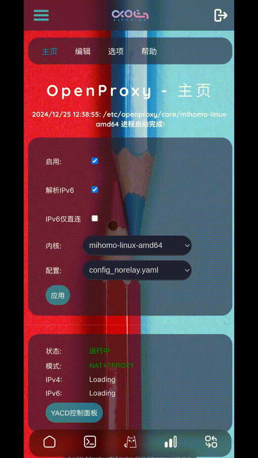

<h1 align="center">
  
  <br>OpenProxy for OpenWRT Plugin<br>
</h1>

# OpenProxy for OpenWRT

A Clash proxy plugin developed for the OpenWRT SNAPSHOT system. For the Chinese [README_CN.md](README_CN.md).

| Latest Version  | Build Status    | Chat   |
| :-------------- | :-------------  | :------|
| [](https://github.com/vxiaov/luci-app-openproxy/releases/latest)| [](https://github.com/vxiaov/luci-app-openproxy/actions/workflows/build_new_package.yml) | [](https://t.me/share_proxy_001/30302) |


## Feature Support
> Due to the low performance of TUN and high CPU resource consumption, this plugin will not support TUN mode for the sake of simplifying functionality and prioritizing performance.

Support features:

- [x] Implementation of basic transparent proxy functionality of Clash.
- [x] Support for online editing of configuration files.
- [x] ~~Support for online editor functionality: diff comparison of configurations.~~ This feature has been canceled; although it can show configuration file differences, there is no practical need for this comparison.
- [x] IPv6 support: DNS resolution for IPv6 addresses.
- [x] IPv6 support: Proxy forwarding of requests for IPv6 addresses.
- [x] Support for options: Backup and restore functionality.
- [x] Support for options: Upload functionality for Clash kernel/configuration files/proxy groups/rule groups.
- [x] Support for options: Update Country.mmdb file.
- [x] Support for options: Core kernel download functionality.
- [x] Support for displaying basic OpenWRT information (for debugging and problem analysis).
- [x] Support for DNS options: Support for Clash built-in DNS (default)/dnsmasq/third-party DNS services (smartDNS/Unbound, etc.).

> You need to configure sniffing for domain names; otherwise, the domain rules will become ineffective.

## Installation
> Important Note: The built-in Clash is for the x86_64 version. For non-x86_64 models, you can manually upload the kernel to use it.


Download release package here: [release](https://github.com/vxiaov/luci-app-openproxy/releases)

To install the APK package (suitable for OpenWRT snapshot version):
```bash
apk add --allow-untrusted ./luci-app-openproxy.apk
```

To install the IPK package (suitable for OpenWRT version 24.10 and earlier):
```bash
opkg install ./luci-app-openproxy.ipk
```

After installation, refresh the LuCI management page or log in again to find the OpenProxy option under the `Services` menu.

> The dependencies for this plugin (which will be automatically installed during the plugin installation, no manual installation required): kmod-nft-nat kmod-nft-socket kmod-nft-tproxy yq

## Usage

- **Ready to use after installation**: You can directly use the default configuration file after installation, reducing the difficulty of editing and debugging configuration files.
- **Simple interface**: Minimizes configuration parameters for users, making the usage method simpler and more intuitive.
- **Configuration editing**: Subscription configurations for proxies and rules are completed in the configuration file.
- **Switching third-party DNS**: By default, it uses Clash's built-in DNS service for domain resolution, but you can switch to other DNS services you prefer, such as smartdns/unbound/dnsmasq in the **Options**.

## Support

- [Clash.Meta](https://github.com/MetaCubeX/mihomo/tree/Meta)
- [yacd](https://github.com/haishanh/yacd): Control Panel

## Preview

| Mobile                   | Desktop Browser       |
| :----------------------- | :-------------------- |
|  |  |

1. Theme: [luci-theme-alpha](https://github.com/derisamedia/luci-theme-alpha)
2. Theme Configuration: [luci-app-alpha-config](https://github.com/animegasan/luci-app-alpha-config)


## License

- [GPL3.0 License](LICENSE).
