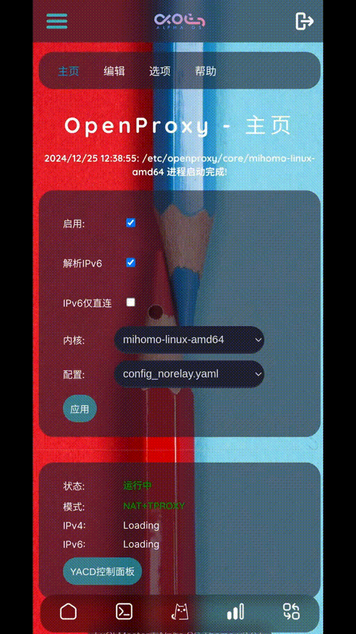
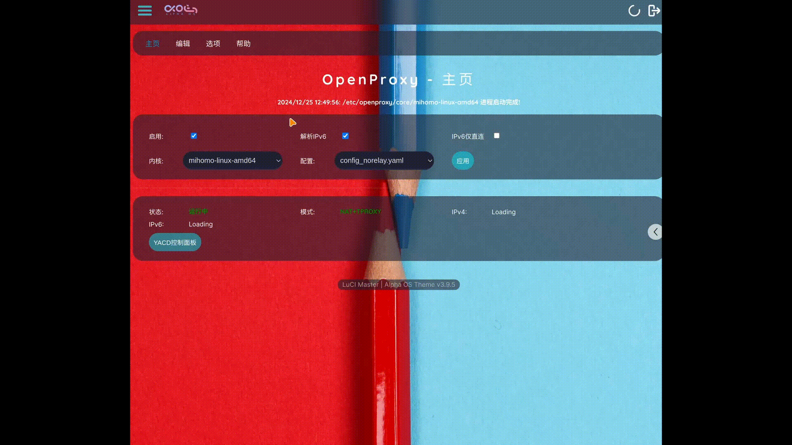

<h1 align="center">
  
  <br>openproxy for openwrt 科学上网插件<br>
</h1>

# openproxy for openWRT

一款针对openWRT SNAPSHOT发行版系统开发的 Clash 代理插件。

| Latest Version  | Build Status    | Chat   |
| :-------------- | :-------------  | :------|
| [](https://github.com/vxiaov/luci-app-openproxy/releases/latest)| [](https://github.com/vxiaov/luci-app-openproxy/actions/workflows/build_new_package.yml) | [](https://t.me/share_proxy_001/30302) |


## 功能支持
> 由于TUN性能比较低且CPU资源消耗较多，本插件出于简化功能、性能优先因素不会支持TUN模式。

开发一切功能都会遵循一个原则： 尽可能减少依赖、尽可能只保留必要的功能。

- [x] clash基础透明代理功能实现。
- [x] 支持在线编辑配置文件。
- [x] ~~支持在线编辑器功能： diff对比配置功能。~~取消此功能实现，此功能虽然可以显示出配置文件差异，但实际中没有这个对比必要。
- [x] IPv6支持: 支持IPv6地址的DNS解析。
- [x] IPv6支持: 支持IPv6地址的请求通过代理转发。
- [x] 支持选项功能: 备份与恢复功能。
- [x] 支持选项功能: Clash内核/配置文件/代理组/规则组配置文件上传功能。
- [x] 支持选项功能: 更新 Country.mmdb 文件。
- [x] 支持选项功能: Core内核下载功能。
- [x] 支持展示openwrt基本信息（用于调试问题分析）
- [x] 支持DNS选项功能：支持clash内置DNS（默认）/dnsmasq/第三方DNS服务(smartDNS/Unbound等)

> 需要配置sniff嗅探域名，否则域名规则就会失效了。

## 安装
> 重要说明： 内置 Clash 为 x86_64 版本， 非 x86_64 机型自己手工上传内核即可使用。


**下载安装包**: [release](https://github.com/vxiaov/luci-app-openproxy/releases)

安装apk包（适用于openWRT snapshot版本）：
```bash
apk add --allow-untrusted ./luci-app-openproxy.apk
```

安装ipk包(适用于 openwrt 24.10及以前的版本)：
```bash
opkg install ./luci-app-openproxy.ipk
```

安装完毕后，刷新luci管理页面，或者重新登录管理页面即可在`服务`菜单下找到 openproxy 选项。


> 本插件的依赖包(安装插件时会自动安装，不需要手工安装)： kmod-nft-nat kmod-nft-socket kmod-nft-tproxy yq

## 使用

- **安装即用**：安装后就可以直接使用默认的配置文件启动，减少自己编辑、调试配置文件的困难。
- **界面简洁**：极可能减少配置参数给使用者，让使用方法更简单直观。
- **配置编辑**：代理、规则的订阅配置都是在配置文件中编辑完成。
- **更换第三方DNS**：默认使用Clash内置的DNS服务解析域名，也可以在**选项**切换使用smartdns/unbound/dnsmasq等其他你喜欢的DNS服务。

## 支持

- [Clash.Meta](https://github.com/MetaCubeX/mihomo/tree/Meta)
- [yacd](https://github.com/haishanh/yacd): 控制面板

## 预览效果

| 移动端 | 桌面浏览器 |
|:--- |:--- |
|  | |


1. 主题[luci-theme-alpha](https://github.com/derisamedia/luci-theme-alpha)
2. 主题配置[luci-app-alpha-config](https://github.com/animegasan/luci-app-alpha-config)

## License

- [GPL3.0 License](LICENSE).
